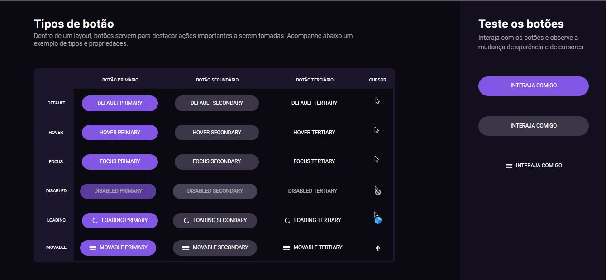

<h1 align="center"><b>#boraCodar</b>Tipos de Botões e Cursores</h1>

  <a href="#-tecnologias">Tecnologias</a>&nbsp;&nbsp;&nbsp;|&nbsp;&nbsp;&nbsp;
  <a href="#-projeto">Projeto</a>&nbsp;&nbsp;&nbsp;|&nbsp;&nbsp;&nbsp;
  <a href="#-layout">Layout</a>&nbsp;&nbsp;&nbsp;|&nbsp;&nbsp;&nbsp;
  <a href="#memo-licença">Licença</a>

  

 

  

## 🚀 Tecnologias

Esse projeto foi desenvolvido com as seguintes tecnologias:

- HTML e CSS
- Bootstrap
- Git e Github

## 💻 Projeto

A Tabela é o terceiro projeto da série de desafios #boraCodar da Rocketseat!

## 🔖 Layout

Visite o deploy <a href="https://abnersuhettdev.github.io/boraCodar-Desafio03/"> aqui !</a>
Você pode visualizar o layout do projeto através [DESSE LINK](https://www.figma.com/community/file/1197534710257750520). É necessário ter conta no [Figma](https://figma.com) para acessá-lo.

## 📝 Licença

Esse projeto está sob a licença MIT.
